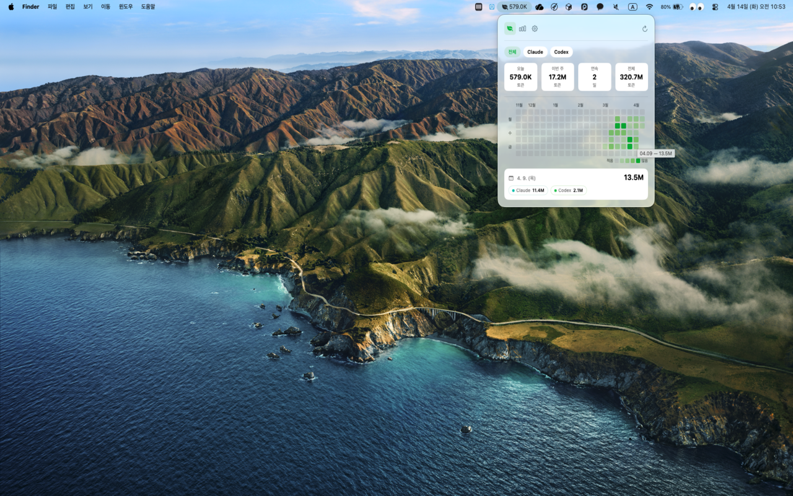

# Token Jandi

## Introdution

Check your Claude Code and Codex token usage easily from the macOS status bar.

## Preview 👀

## What's New in 1.2.0

- Improved Codex token accuracy by reading full turn totals instead of only the latest usage delta.
- Added Codex 5-hour and 7-day limit usage cards with reset times.
- Added a local-data notice for multi-device account usage.

## Data Accuracy

Token Jandi reads Claude Code and Codex usage from local files on the current Mac. If you use the same Claude or Codex account on multiple devices, usage from other devices may not appear in this app.

## Requirements

- `Token Jandi` is written in Swift 5.9
- Compatible with macOS 14 +

## Install

### Mac App Store

[Download Token Jandi on the Mac App Store](https://apps.apple.com/kr/app/token-jandi/id6761585375?mt=12)

## License 
`Token Jandi` is available under the MIT license. See the LICENSE file for more info.
